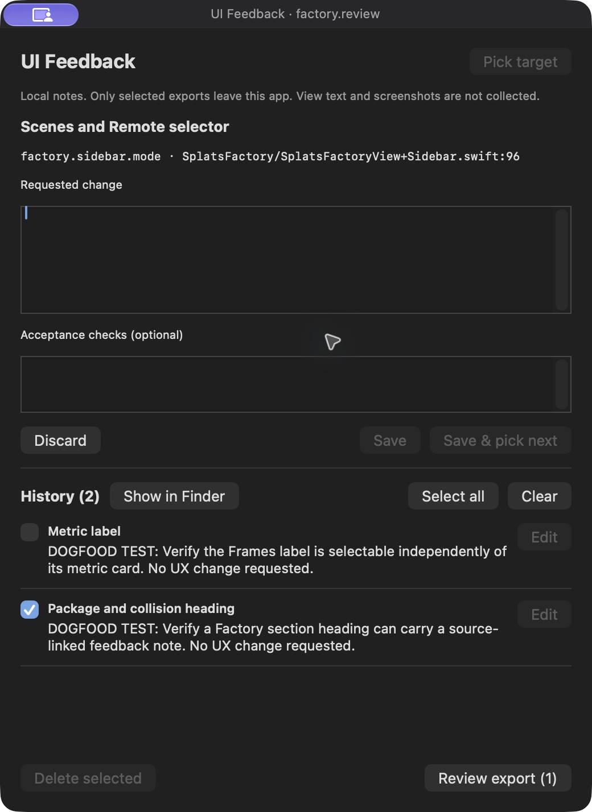
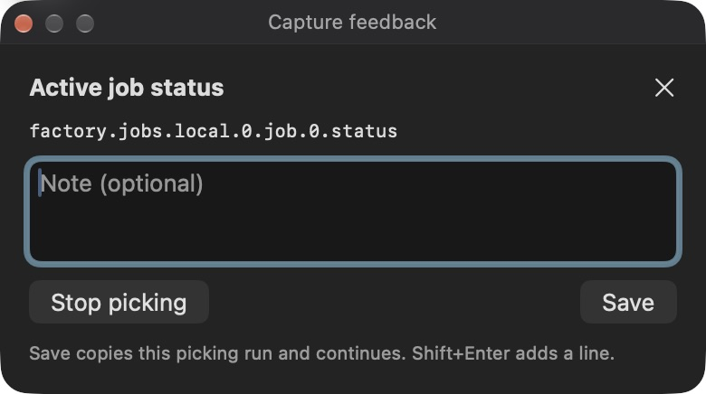

# Native capture dogfood evidence

Before and After are authentic app-window captures from Splats Lab on the personal MacBook Pro (Mac17,9/M5 Pro). Before shows the old build173 empty-draft blocker; After shows the compact capture UI in installed175, using package a38d355. The installed app is intentionally preserved while publication-only follow-up fixes receive regression coverage. These images are not claimed to be captures of the final PR head.

## Before — build173

## After — build175

Installed175 verified three close/repick cycles with141 visible Factory targets and no duplicate IDs. The same package's end-to-end174 test verified label/action capture, optional notes, Enter save/resume, current-run clipboard contents, screen-scoped JSON export and legacy-record preservation. Factory scene data was unchanged. Native exports remain distinct from the browser MCP schema.
